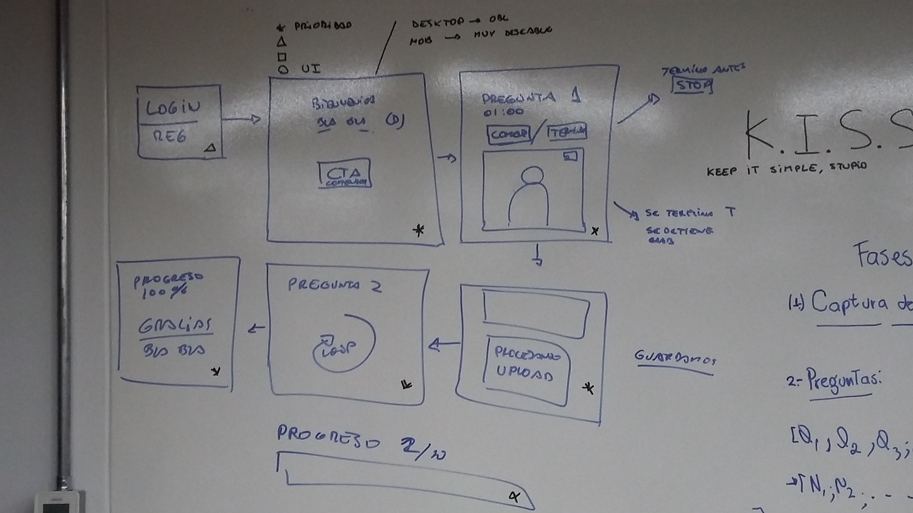

# ENTREVISTAS ONLINE

***

## Introducción :
Este proyecto consiste en implementar una aplicación web que pueda “entrevistar”, de manera remota y autónoma las postulantes a Laboratoria. Cada postulante debe grabar (audio y video) una respuesta para cada pregunta que le haga el app.

## PLAN DE TRABAJO : 

El proyecto se realizó en 36 horas, se tuvieron reuniones cada 3 horas para verificar los avances del proyecto y para ello se propuso dividir el proyecto en una serie de etapas que se detallarán a continuación :

#### ETAPA 1 : 
* Dibujar el sketch del proyecto ( imagen adjunta al final de esta etapa).
* Definir los framework y las tecnologías a  utilizar.
* Priorización de los requerimientos (visibles en la imagen adjunta).

#### ETAPA 2 :

* Division de las funcionalidades de la aplicacion:
  * Maquetado vistas principales(  Responsive web design).
  * Algoritmos de ordenamiento para las preguntas.
  * Manipulación del API.
  * Almacenamiento de datos en Firebase.

## Autoras

* Rocci Escobar Nuñez [Cuenta GitHub](https://github.com/Rocciescobar "titulo")
* Manuela Flores Vilchez [Cuenta GitHub ](https://github.com/Manu160296 "titulo")
* Araceli Gutarra Soto [Cuenta GitHub](https://github.com/AraceliGS "titulo")
* Lilliam Haro Bernal [Cuenta GitHub](https://github.com/LilliamHaro?tab=repositories "titulo")
* Milagros Palma Sáenz [Cuenta GitHub](https://github.com/milagrospalma?tab=repositories "titulo")